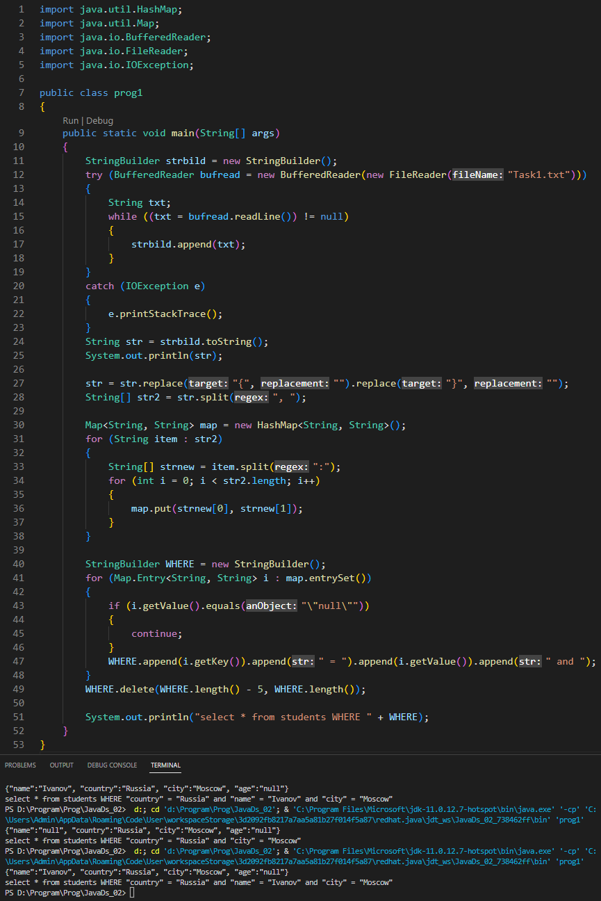
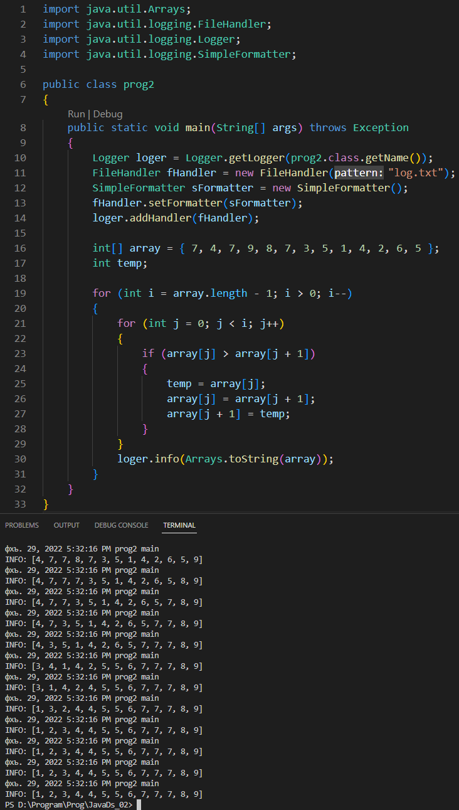

# Урок 2. Почему вы не можете не использовать API

## Задание 1
### Дана строка sql-запроса "select * from students where ". Сформируйте часть WHERE этого запроса, используя StringBuilder. Данные для фильтрации приведены ниже в виде json строки.
### Если значение null, то параметр не должен попадать в запрос.
### Параметры для фильтрации: {"name":"Ivanov", "country":"Russia", "city":"Moscow", "age":"null"}

## Задание 2
### Реализуйте алгоритм сортировки пузырьком числового массива, результат после каждой итерации запишите в лог-файл.
